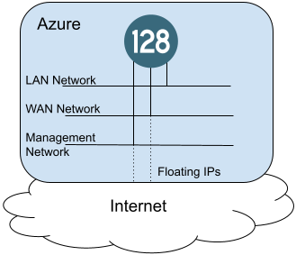

# Session Smart Router Azure Terraform Example

## Topology
The terraform in this repo will generate the topology shown below. This consists of a new virtual network with three subnets (management, WAN, and LAN. It creates one network interfaces per subnet. It creates a public IP for the management and WAN interfaces. It creates a VM based on an official Session Smart Router image and assigns tags that will be used to initialize the image and point the salt-minion to a Session Smart Conductor.


## Steps to Run
1. Login to Azure. Install the Azure CLI following [Microsoft's Documentation](https://docs.microsoft.com/en-us/cli/azure/install-azure-cli). After installation run the command `az login` to authenticate to your account. This will open a browser to complete the login process.
> **Note:** If your login is linked to multiple accounts you should run `az login --tenant TENANT_ID` indicating the subscription you wish to use

2. Create a file named `me.auto.tfvars` to set variable values. There are many variables that can be overridden, but most can be left at their defaults, depending on your requirements. The terraform does assume a resource group has been created in the Azure account in advance and we need to set a value for it in this file, as shown in the example below. A valid, routable IP address for the conductor must also be provided.
```
azure_resource_group_name = "128Technology"
conductor1_ip = "<conductor IP address>"
```

3. Initialize the terraform repo and apply the configuration. Terraform should use the authentication key from Step 1 when communicating to the Azure APIs.
```bash
terraform init
terraform apply
```
After building the environment, the public IP address for the router's management interface will be returned.

## Steps to Tear Down
To destroy all resources that were built in this topology, run the following commands
```bash
terraform destroy
```
